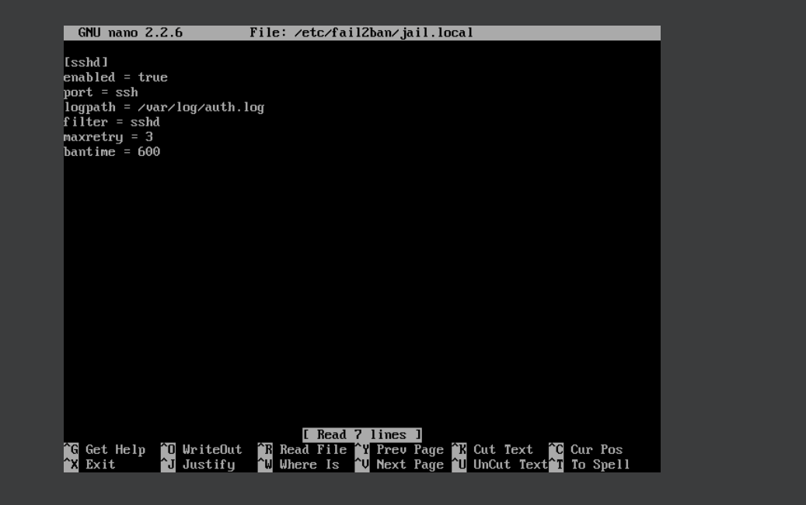
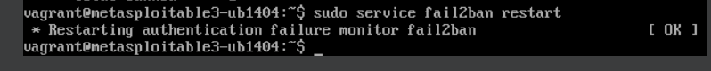
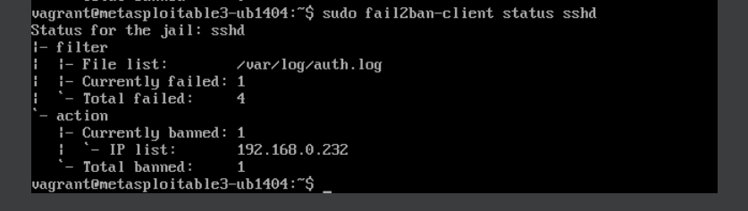
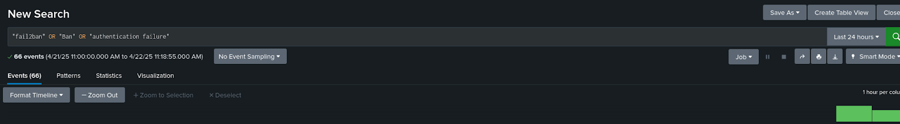
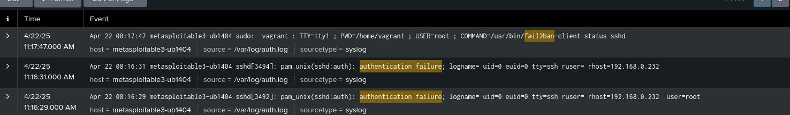
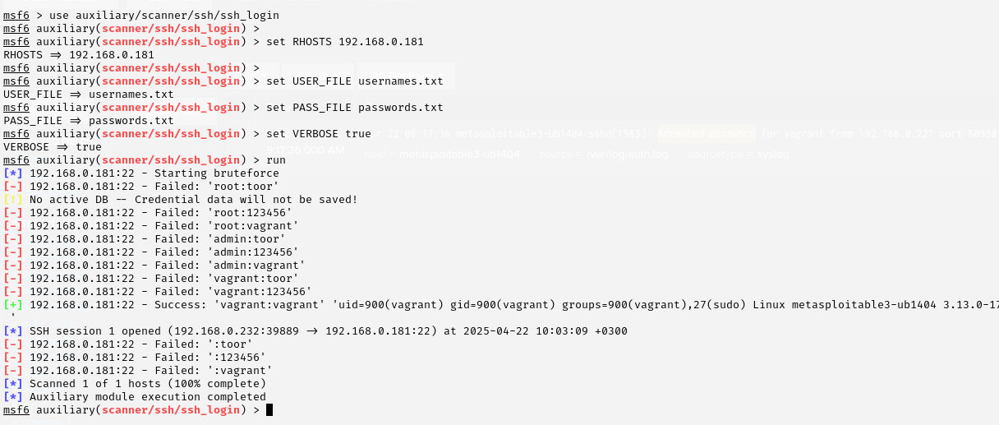
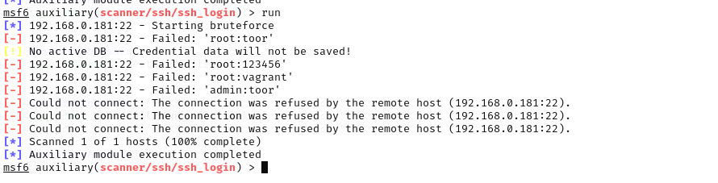

---

# King Fahd University of Petroleum & Minerals  
**Information and Computer Science Department**

---

## ICS344: Information Security

# Phase 3: SSH Defense Using Fail2Ban

## 1. Overview

In Phase 3, we implemented a defensive mechanism to protect the SSH service of the victim machine (Metasploitable3) using **Fail2Ban**. We then reran the same brute-force attack from Phase 1 and 2, and analyzed the logs using **Splunk** to verify that the attack was detected and mitigated. Fail2Ban automatically banned the attacking IP address after repeated failed login attempts.

---

## 2. Defense Mechanism: Fail2Ban

Fail2Ban scans log files such as `/var/log/auth.log` for signs of brute-force attacks. When it detects too many failed login attempts, it updates the firewall rules to ban the attacker's IP address temporarily.

---

## Step 1: Install Fail2Ban on Metasploitable3

```bash
sudo apt update
sudo apt install fail2ban -y
```

---

## Step 2: Start Fail2Ban (Ubuntu 14.04)

```bash
sudo service fail2ban start
```

---

## Step 3: Configure Fail2Ban for SSH

Edit the configuration:

```bash
sudo nano /etc/fail2ban/jail.local
```

Paste the following:

```ini
[sshd]
enabled = true
port = ssh
logpath = /var/log/auth.log
filter = sshd
maxretry = 3
bantime = 600
```

Save and exit.

Restart Fail2Ban to apply the configuration:

```bash
sudo service fail2ban restart
```

---

## Step 4: Re-run the Brute Force Attack from Kali

From Kali, run the brute-force attack using Metasploit:

```bash
sudo msfconsole
use auxiliary/scanner/ssh/ssh_login
set RHOSTS 192.168.0.181
set USER_FILE usernames.txt
set PASS_FILE passwords.txt
set VERBOSE true
run
```

> Fail2Ban correctly banned the attacker's IP after the 3rd failed login attempt.

---

## Step 5: Check Ban Status and Logs

Check if the IP got banned:

```bash
sudo fail2ban-client status sshd
```

---

### In Splunk

* Navigated to:
  `Search & Reporting → Data Summary → /var/log/auth.log`

* Used the following search query:

```spl
"fail2ban" OR "Ban" OR "authentication failure"
```

> Found Fail2Ban logs confirming the IP was banned after the third login attempt.

---

## Step 6: Compare Before vs After

| Before Defense                      | After Defense                           |
| ----------------------------------- | --------------------------------------- |
| Successful login: `vagrant:vagrant` | Attack blocked, IP banned after 3 tries |

### Before:



### After:



---

## 7. Summary & Findings

* **Fail2Ban** was successfully installed and configured on Metasploitable3.
* The **same SSH brute-force attack** was re-executed from Kali.
* Fail2Ban **detected** the attack and **banned the attacker IP** after multiple failures.
* **Splunk logs** confirmed the detection and blocking behavior.
* The defense mechanism was **effective** in mitigating the brute-force attack.

---